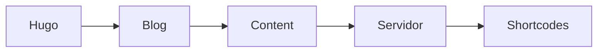

+++
title = 'Shortcodes'
date = 2023-09-25T10:30:07+02:00
draft = false
+++

1. [Attachments](#1-attachments)
2. [Badge](#2-badge)
3. [Button](#3-button)
4. [Children](#4-children)
5. [Expand](#5-expand)
6. [Highlight](#6-highlight)
7. [Icon](#7-icon)
8. [Include](#8-include)
9. [Math](#9-math)
10. [Mermaid](#10-mermaid)
11. [Notice](#11-notice)
12. [SiteParam](#12-siteparam)
13. [Tab](#13-tab)
14. [Tabs](#14-tabs)

## 1. Attachments

Los "attachments" Sirve principalmente para mostrar una lista de ficheros que nos dirige a otra página.
Para ello de debe crear una carpeta específica a mismo nivel que el "_index.md" de la página que nos interesa con el nombre de "_index.files". Pero para páginas sueltas, podemos crear un fichero con el mismo nonbre y que acabe en ".files".

Es importante que si existe diferentes ficheros para los posibles diferentes lenguajes que este traducido la página hay que añadir entre el nombre y la extension la abreviación de cada idioma. Por ejemplo, en inglés sería "_index.en.files" o que en español sería "_index.en.file" o que en chino "_index.cn.files".

Se puede mostrar los ficheros de dos formas:
- De forma personalizada, eligiendo que formatos son admitido y en que orden sean mostrados.

- Y la otra forma es mostrar todos los ficheros en un recuadro personalizables de forma ordenada alfabeticamente

Se puede personalizar el encuadre con los siguientes parámetros:
- **style**, para mostrar un estilo predefinido
- **color**, para cambiar el color que se muestra
- **title**, el texto de la cabecera
- **icon**, un pequeño icono a la izquierda del título

Por ejemplo:

## 2. Badge

Usar badge nos muestra un pequeño marcado personalizable, con un determinador color, un determinado título y opcionalmente un icono en cualquier parte de la web, como en mitad de un parrafo para remarcas algun dato importante. Generalmente sirve para dar una pequeña información o simplemte de decoración.

Formato | Comando | Resultado
-|-|-
Negrita | `** **` | **Pone el texto en negrita.**
Cursiva | `_ _` | _Pone el texto en cursiva._
Tachado | `~~ ~~` | ~~Tacha el texto.~~

## 3. Button

Simplemente muestra un botón clickeable que puede usarse de varias formas como:
- Referenciar a un apartado de la misma página
- Mandarte a un link externo
- Mostrar información
- Descargar achivos
- Y muchos más opciones

El Button posee varios parametro que podemos cambio o/y añadir.
Nombre | Comando | Resultado
-|-|-
href | `** **` | **Pone el texto en negrita.**
style | `_ _` | _Pone el texto en cursiva._
color | `~~ ~~` | ~~Tacha el texto.~~
icon | `** **` | **Pone el texto en negrita.**
iconposition | `_ _` | _Pone el texto en cursiva._
target | `~~ ~~` | ~~Tacha el texto.~~
type | `~~ ~~` | ~~Tacha el texto.~~

## 4. Children

El Children es una shortcode que sirve para mostrar en una lista, las páginas hijos de la página actual.

{}

## 5. Expand

El Expand, como lo dice el nombre, sirve para expandir o colapsar una sección de texto y es posible que en algunos dispositivos más antiguos no funcione correctamente.

La sección puede estar ya expandida si se añade `open="true"` después del título. También es posible contener todo tipo de textos, ya sean tablas, listas, bloques de código... etc.

## 6. Highlight

Sirve principalmente para resaltar un parte de un bloque de código. En el fichero hugo.toml se puede configurar parámetros del shortcode "hightlight" detro de [markup] --> [markup.highlight]

Es recomendable dejar el parámetro de "lineNumbersInTable" es false cuando se quiera usar este shortcode, ya que puede descuadrar las líneas.

## 7. Icon

Icon muestra emoticonos de la librería 

## 8. Include

## 9. Math

## 10. Mermaid

EL Mermaid genera una diagrama de flujo con los textos usando la libreria de Mermaid. Se recomiendo usar generalmente con un bloque de código en vez de por shortcode por temas de compatibilidad.

## 11. Notice

## 12 SiteParam

## 13. Tab

## 14. Tabs

    

